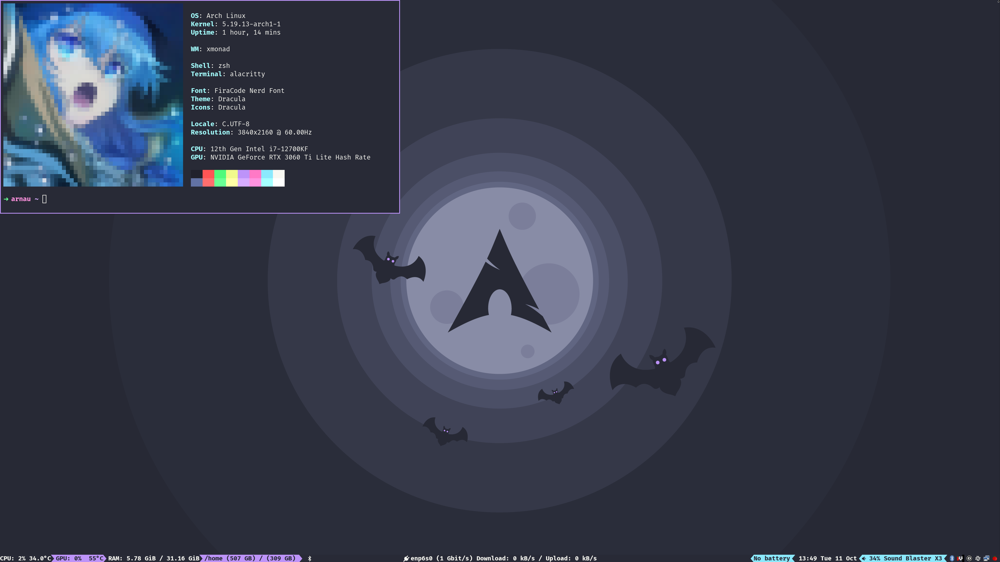

Hi, my name is **Arnau Abella**. I'm a **software engineer** based in **Barcelona** (Spain).

- :link: [Twitter](https://twitter.com/monadplus)
- :link: [Linkedin](https://www.linkedin.com/in/arnau-abella/)
- :link: [Blog](https://monadplus.pro/)
- :scroll: [Curriculum Vitae](https://monadplus.pro/assets/documents/cv.pdf)
- :envelope: `arnau.abella <at> monadplus.pro`

On 2017, I obtained my **BSc in Computer Science** at Facultat d'Informàtica de Barcelona ([FIB](https://www.fib.upc.edu/en)). Later, on 2022, I obtained my **MSc in Computer Science** at Universitat Politècnica de Catalunya ([UPC](https://www.fib.upc.edu/)).

I have been developing software profesionally since 2017. 
I have worked in several interesting projects including:
- A payment gateway.
- A real-time routing algorithm.
- A knowledge management system for museums.
- A smart remote controller for industrial cold rooms.

My programming journey:
- [Scala](https://scala-lang.org/) (2017-2019)
  - Author: [equality](https://github.com/monadplus/equality), and [DCORE](https://github.com/dtim-upc/DCORE)
  - Contributor: [fs2](https://github.com/typelevel/fs2), and [scala-pet-store](https://github.com/pauljamescleary/scala-pet-store)
  - Talks: [Generic Programming in Scala with Shapeless](https://github.com/monadplus/intro-shapeless), and [Lenses in Scala with Monacle](https://github.com/monadplus/scala-lenses)
- [Haskell](https://www.haskell.org/) (2018-now):
  - Author: [CPP-lang](https://github.com/monadplus/CPP-lang), [rbst](https://hackage.haskell.org/package/rbst), [floorplanning](https://github.com/monadplus/floorplanning), [parsing-by-example](https://github.com/monadplus/parsing-by-example), and [twitch game](https://github.com/monadplus/twitch-game)
  - Contributor: [prometheus-port](https://github.com/on-ramp/prometheus-port)
  - Talks: [Parallelism and Concurrency in Haskell](https://github.com/monadplus/parconc-notes/tree/main/talk)
- [Rust](https://www.rust-lang.org/) (2021-now)
  - Author: [better-default-derive](https://crates.io/crates/better-default-derive), [toy_atm](https://github.com/monadplus/toy_atm)
  - Contributor:
  - Talks:

Other projects: [Stroke prediction](https://github.com/monadplus/ml-project), [box wrapping problem](https://github.com/monadplus/box_wrapping_problem), [plfa: solutions](https://github.com/monadplus/plfa-solutions)...

